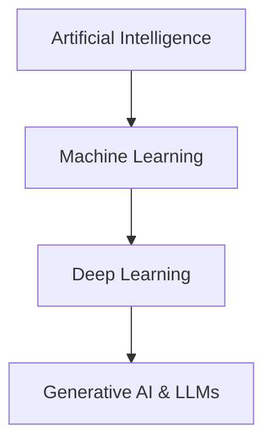

# Artificial Intelligence (AI) - Comprehensive Technical & Operational Guide
*(A complete reference manual on how AI works, architectures, algorithms, safety protocols, and alignment rules)*

---

## 1. Introduction to Artificial Intelligence (AI)

Artificial Intelligence (AI) is the branch of computer science focused on building intelligent systems capable of performing tasks that typically require human intelligence. These tasks include learning, reasoning, problem-solving, perception, and natural language understanding.



### Key Milestones in AI History
1. **The Turing Test (1950):** Alan Turing proposed a measure of machine intelligence: can a machine converse indistinguishably from a human?
2. **Dartmouth Workshop (1956):** The term "Artificial Intelligence" was coined, establishing AI as an academic discipline.
3. **The Connectionist Era (1980s):** Backpropagation algorithm popularized multi-layer neural networks.
4. **Deep Learning Breakthrough (2012):** ImageNet competition won by AlexNet, proving the power of deep convolutional networks.
5. **The Transformer Revolution (2017):** Google published "Attention Is All You Need", introducing the Transformer architecture which underpins all modern LLMs (Gemini, Claude, GPT).

---

## 2. Core Categories of AI

### A. Categorization by Capability
*   **Artificial Narrow AI (ANI):** Also known as Weak AI. ANI is designed and trained for a specific task (e.g., facial recognition, chess playing, spam filtering). All existing AI systems today are ANI.
*   **Artificial General AI (AGI):** Strong AI. A hypothetical system that possesses the ability to understand, learn, and apply knowledge across any intellectual task at a human level.
*   **Artificial Super Intelligence (ASI):** A hypothetical phase where AI surpasses human intelligence across all domains, including creative play, emotional wisdom, and social skills.

### B. Categorization by Architecture
*   **Discriminative AI:** Models trained to classify data or predict outcomes (e.g., determining if an image is a cat or a dog). It estimates the probability of a label $Y$ given input features $X$: $P(Y|X)$.
*   **Generative AI:** Models trained to generate new data instances resembling the training dataset (e.g., generating text, images, or audio). It models the joint probability distribution $P(X, Y)$ or $P(X|Y)$.

---

## 3. How AI Works: Mathematical & Algorithmic Foundations

All modern AI operates on **Machine Learning (ML)**—specifically **Deep Learning (DL)** utilizing artificial neural networks. Instead of writing explicit rules, programmers provide the system with vast data and feedback mechanisms, allowing the system to learn the rules itself.

```
[Input Data (X)] ---> [Neural Network / Weights (W) + Biases (b)] ---> [Prediction (Y_hat)]
                               ^                                             |
                               |                                             v
                     [Optimization: SGD] <--- [Loss Calculation (L)] <--- [Compare with Y]
```

### A. Artificial Neural Networks (ANN)
An ANN is modeled loosely on the human brain. It consists of layers of interconnected nodes (neurons):
1.  **Input Layer:** Receives the raw data (e.g., image pixels, tokenized words).
2.  **Hidden Layers:** Perform mathematical transformations to extract features.
3.  **Output Layer:** Produces the final prediction (e.g., classification label, next word token probability).

Each connection between neurons has a **Weight ($w$)** and a **Bias ($b$)**. The mathematical output of a single neuron is:
$$z = \sum (w_i \cdot x_i) + b$$

### B. Activation Functions
To model non-linear complex real-world patterns, an activation function $f(z)$ is applied to the output of each neuron:
*   **ReLU (Rectified Linear Unit):** $f(x) = \max(0, x)$ - Fast to calculate, prevents vanishing gradients.
*   **Sigmoid:** $f(x) = \frac{1}{1 + e^{-x}}$ - Maps output to $(0, 1)$, ideal for binary classification.
*   **Softmax:** Turns a vector of raw scores into probability distributions that sum up to 1. Used in LLM output layers.

### C. The Training Process
1.  **Forward Propagation:** Input features travel through layers to generate a prediction ($\hat{y}$).
2.  **Loss Function ($L$):** Measures the error between the model's prediction ($\hat{y}$) and the actual target ($y$).
    *   *Mean Squared Error (MSE):* $L = \frac{1}{n}\sum(y_i - \hat{y}_i)^2$ (For regression).
    *   *Cross-Entropy Loss:* $L = -\sum y_i \log(\hat{y}_i)$ (For classification and LLMs).
3.  **Backpropagation:** Using calculus (the Chain Rule), the model calculates the gradient of the loss function with respect to each weight and bias in the network:
    $$\frac{\partial L}{\partial w}$$
4.  **Gradient Descent & Optimization:** The weights are updated in the opposite direction of the gradient to minimize the loss:
    $$w_{\text{new}} = w_{\text{old}} - \eta \frac{\partial L}{\partial w}$$
    *(where $\eta$ is the learning rate)*.

---

## 4. Modern LLM Architecture: The Transformer

Large Language Models (LLMs) like Gemini, Claude, and GPT are built on the **Transformer** architecture. The core innovation of the Transformer is the **Self-Attention Mechanism**, which allows the model to process words in relation to all other words in a sentence, capturing long-range context efficiently.

### A. Tokenization
Before text enters an LLM, it is broken down into smaller units called **Tokens** (words or sub-words). 
*   Example: `"Antigravity"` -> `["Anti", "gravity"]` -> `[12450, 4821]`.

### B. Vector Embeddings
Each token is mapped to a high-dimensional vector (e.g., 4096 dimensions). Tokens with similar meanings sit close to each other in this vector space.
*   $\text{King} - \text{Man} + \text{Woman} \approx \text{Queen}$

### C. Self-Attention Calculation
For every input word token, the model calculates three vectors:
1.  **Query ($Q$):** What the token is looking for.
2.  **Key ($K$):** What information the token contains.
3.  **Value ($V$):** The actual content of the token.

The attention scores are calculated using the Scaled Dot-Product formula:
$$\text{Attention}(Q, K, V) = \text{softmax}\left(\frac{Q K^T}{\sqrt{d_k}}\right) V$$

This formula allows the model to assign different "weights" (attention levels) to different words. In the sentence *"The animal didn't cross the street because it was too tired"*, the model uses attention to resolve that **"it"** refers to the **"animal"**, not the **"street"**.

---

## 5. Standard Decoding Strategies in LLMs

When generating the next token, the LLM outputs a probability distribution over the entire vocabulary. Several parameters control how the model selects the next token:

| Parameter | Function | Low Value | High Value |
| :--- | :--- | :--- | :--- |
| **Temperature** | Controls randomness of predictions | **Greedy & Deterministic:** Always picks the highest probability token. Best for coding and math. | **Creative & Random:** Broadens token options. Best for creative writing. |
| **Top-p (Nucleus)** | Cumulative probability threshold | Restricts choice to a very small pool of highly likely tokens. | Considers a larger pool of tokens, adding variety. |
| **Top-k** | Selects from the top $K$ tokens | Filters out unlikely tokens aggressively. | Allows a wider set of vocabulary. |

---

## 6. The 4 Stages of Training a Modern AI Assistant

```
[Raw Web Data] ---> Stage 1: Pre-training (Base Model)
                           |
                           v
[Curated QA Pairs] -> Stage 2: Supervised Fine-Tuning (SFT / Instruct Model)
                           |
                           v
[Human Feedback] ----> Stage 3: Alignment (RLHF / DPO / Safety Guardrails)
                           |
                           v
[System Prompts] ----> Stage 4: Inference (Production Assistant)
```

1.  **Pre-training (Self-Supervised Learning):**
    *   **Data:** Terabytes of raw web text, books, code repositories.
    *   **Goal:** Next-token prediction. The model learns grammar, facts, reasoning, and world knowledge.
    *   **Output:** Base Model (predicts next word, does not behave like a helpful assistant yet).
2.  **Supervised Fine-Tuning (SFT):**
    *   **Data:** High-quality, curated datasets of prompt-response pairs written by humans.
    *   **Goal:** Teaching the model how to act like a helpful assistant (Instruction following).
    *   **Output:** Instruct Model.
3.  **Alignment & Reinforcement Learning (RLHF / DPO):**
    *   **Goal:** Aligning the model with human values (helpfulness, honesty, harmlessness).
    *   **Method:**
        *   **RLHF (Reinforcement Learning from Human Feedback):** Humans rate multiple model outputs. A Reward Model is trained, and PPO (Proximal Policy Optimization) optimizes the model to maximize reward.
        *   **DPO (Direct Preference Optimization):** Directly trains the model on binary preferences (Preferred output vs Rejected output) without a separate reward model.
4.  **System Prompts & Safety Filters:**
    *   Injecting system instructions (e.g., "You are a helpful coding assistant...") and configuring hard runtime blocks to reject dangerous requests.

---

## 7. AI Ethics, Safety Rules & Alignment

As AI systems become more powerful, strict rules are required to ensure they remain safe and do not cause harm.

### A. Classic Foundations: Asimov's Three Laws of Robotics
Although conceptual, sci-fi author Isaac Asimov outlined three rules that initiated the safety conversation:
1.  **First Law:** A robot may not injure a human being or, through inaction, allow a human being to come to harm.
2.  **Second Law:** A robot must obey orders given it by human beings except where such orders would conflict with the First Law.
3.  **Third Law:** A robot must protect its own existence as long as such protection does not conflict with the First or Second Law.

### B. Modern AI Alignment Rules (The 3 Hs)
Linguistic and safety researchers align models around three core pillars:
1.  **Helpfulness:** The model should fulfill the user's request efficiently and accurately.
2.  **Honesty:** The model must state truth, avoid fabricating facts (hallucinations), and express uncertainty when it doesn't know.
3.  **Harmlessness:** The model must refuse to assist in illegal activities, hate speech, self-harm, cyberattacks, weapon creation, or harassment.

### C. Operational Guardrails in Production Models
To enforce harmlessness, production platforms implement:
*   **Red Teaming:** Human security experts simulate malicious prompt attacks (jailbreaks) to discover vulnerabilities and patch them.
*   **Input/Output Filters:** Separate lightweight classifier models scan the user's prompt (Input) and the model's response (Output) for violations.
*   **Differential Privacy:** Training techniques that ensure private user data cannot be extracted or memorized by the model.
*   **Copyright Compliance:** Filtering systems to prevent the generation of direct copies of copyrighted books, music, or code unless authorized.
